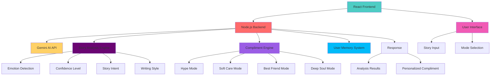

# System Architecture

```mermaid
graph TD
    A[React Frontend] --> B[Node.js Backend]
    B --> C[Gemini AI API]
    B --> D[Story Analysis Engine]
    D --> E[Emotion Detection]
    D --> F[Confidence Level]
    D --> G[Story Intent]
    D --> H[Writing Style]
    B --> I[Compliment Engine]
    I --> J[Hype Mode]
    I --> K[Soft Care Mode]
    I --> L[Best Friend Mode]
    I --> M[Deep Soul Mode]
    B --> N[User Memory System]
    A --> O[User Interface]
    O --> P[Story Input]
    O --> Q[Mode Selection]
    B --> R[Response]
    R --> S[Analysis Results]
    R --> T[Personalized Compliment]

    style A fill:#4ecdc4
    style B fill:#ff6b6b
    style C fill:#ffd166
    style D fill:#6a0572
    style I fill:#9b5de5
    style N fill:#00bbf9
    style O fill:#f15bb5
```