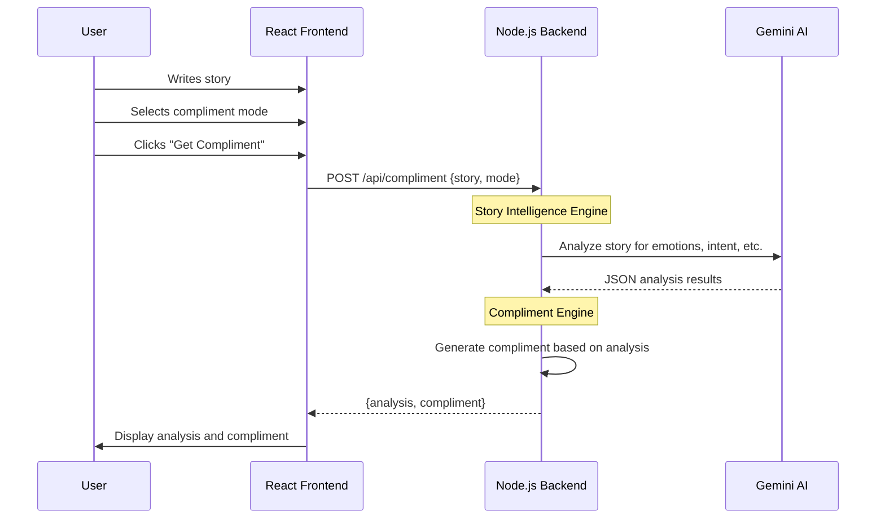

# Data Flow Diagram

```mermaid
sequenceDiagram
    participant User
    participant ReactUI as React Frontend
    participant NodeAPI as Node.js Backend
    participant Gemini as Gemini AI
    
    User->>ReactUI: Writes story
    User->>ReactUI: Selects compliment mode
    User->>ReactUI: Clicks "Get Compliment"
    
    ReactUI->>NodeAPI: POST /api/compliment {story, mode}
    
    Note over NodeAPI: Story Intelligence Engine
    NodeAPI->>Gemini: Analyze story for emotions, intent, etc.
    Gemini-->>NodeAPI: JSON analysis results
    
    Note over NodeAPI: Compliment Engine
    NodeAPI->>NodeAPI: Generate compliment based on analysis
    NodeAPI-->>ReactUI: {analysis, compliment}
    
    ReactUI->>User: Display analysis and compliment
```