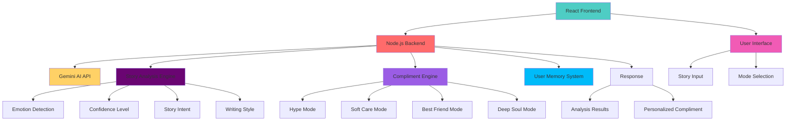

# AI Story Compliment Generator - Complete System Overview

## System Architecture



## Core Components

### 1. Story Intelligence Engine
- **Purpose**: Deep analysis of user stories using AI
- **Features**:
  - Emotion level detection (happy, sad, proud, stressed, etc.)
  - Confidence level scoring (1-10)
  - Story intent classification (achievement, pain, self-growth, creativity)
  - Writing style identification (funny, poetic, casual, serious)

### 2. Compliment Personality Engine
- **Purpose**: Generate personalized compliments based on analysis
- **Modes**:
  - **Hype Mode 🔥**: Strong motivational compliments for achievements
  - **Soft Care Mode 🤍**: Warm, emotional compliments for sensitive stories
  - **Best Friend Mode 🧸**: Friendly, casual compliments
  - **Deep Soul Mode 🌙**: Thoughtful, introspective compliments
  - **Auto Mode 🤖**: Automatic selection based on story analysis

### 3. Real-time Processing
- **Purpose**: Instant feedback when users post stories
- **Features**:
  - Immediate story scanning upon submission
  - Rapid emotional/state analysis
  - Dynamic compliment style selection
  - Instant delivery of personalized compliments

### 4. Safety & Smartness Layer
- **Purpose**: Ensure authentic and appropriate interactions
- **Features**:
  - Prevents fake or over-hyped compliments
  - Automatically adjusts tone for different emotional contexts
  - Maintains human-like interaction quality

## Technology Stack

### Backend (Node.js)
- **Framework**: Express.js
- **AI Integration**: Google Generative AI (Gemini)
- **API**: RESTful endpoints
- **Key Libraries**:
  - `@google/generative-ai` for AI integration
  - `express` for web server
  - `cors` for cross-origin requests
  - `dotenv` for environment configuration

### Frontend (React)
- **Framework**: React with Vite
- **Styling**: CSS with modern responsive design
- **Key Libraries**:
  - `react` for UI components
  - `vite` for development server and build tool

## API Endpoints

### POST /api/compliment
- **Purpose**: Analyze a story and generate a compliment
- **Request Body**:
  ```json
  {
    "story": "Your story text here...",
    "mode": "hype|softCare|bestFriend|deepSoul|auto"
  }
  ```
- **Response**:
  ```json
  {
    "analysis": {
      "emotionLevel": "proud",
      "confidenceLevel": 8,
      "storyIntent": "achievement",
      "writingStyle": "casual"
    },
    "compliment": "Your personalized compliment here..."
  }
  ```

### GET /api/health
- **Purpose**: Health check endpoint
- **Response**:
  ```json
  {
    "status": "OK",
    "message": "Story Compliment AI is running!"
  }
  ```

## Future Enhancements

### User Memory System
- Store previous stories for longitudinal analysis
- Track emotional posting patterns to understand user journey
- Record compliment engagement (likes/ignores) to refine future responses

### Futuristic Features
- **AI Voice Compliments**: Audio delivery of compliments
- **Avatar Responses**: Animated AI companions
- **Motivational Quotes**: Context-aware inspirational quotes
- **Mood Animations**: Background animations matching emotional tone

## Deployment Instructions

1. **Backend Setup**:
   ```bash
   cd backend
   npm install
   # Add your GEMINI_API_KEY to .env
   npm run dev
   ```

2. **Frontend Setup**:
   ```bash
   cd frontend
   npm install
   npm run dev
   ```

3. **Full System**:
   ```bash
   # In root directory
   npm run dev  # Runs both frontend and backend
   ```

## Troubleshooting

If you encounter issues:

1. **API Key Issues**:
   - Verify your API key in `.env` file
   - Run `node test-api-key.js` to test your key
   - Check Google Cloud Console for API access

2. **Model Not Found**:
   - Try different model names in `server.js`
   - Common alternatives: `gemini-1.0-pro`, `gemini-1.5-pro-latest`

3. **Connection Issues**:
   - Ensure backend is running on port 5000
   - Check frontend proxy configuration in `vite.config.js`